# LawGenius

LawGenius, bireyler ve küçük işletmeler için yapay zeka destekli bir hukuk danışmanlığı platformudur. Kullanıcılar, chatbot aracılığıyla hukuki sorularına hızlı yanıtlar alabilir, gerektiğinde gerçek avukatlarla birebir iletişim kurabilir.

---

## 📁 Proje Yapısı

```
FinalThesis/
├── backend/           # Node.js & FastAPI backend
├── frontend/          # Angular frontend
├── node_modules/
├── screenshots/       # Ekran görüntüleri
└── README.md
```

---

## 🚀 Özellikler

- 🤖 AI destekli hukuk danışmanı (OpenAI + Fine-tuned Türkçe hukuk modeli)
- 👥 Kullanıcılar ile avukatlar arasında özel mesajlaşma sistemi
- 🔐 JWT ile kimlik doğrulama ve rol tabanlı yetkilendirme
- 🌐 Çok dilli arayüz (Türkçe ve İngilizce)
- 📊 Chat geçmişi, konuşma yönetimi, avukat başvuru sistemi

---

## 📦 Kullanılan Teknolojiler

- **Frontend:** Angular, TypeScript
- **Backend:** Node.js (Express), FastAPI
- **Veritabanı:** MongoDB
- **AI:** OpenAI API, Mistral-7B (LoRA)
- **Kimlik Doğrulama:** JWT, Role-based Access Control

---

## 🛠️ Kurulum

### 1. Reponun klonlanması

```bash
git clone https://github.com/tgbktrk/LawGenius.git
cd LawGenius
```

### 2. Ortam dosyalarının hazırlanması

- `backend/.env` ve `frontend/.env` dosyalarını oluşturun
- İçerik için `backend/.env.example` ve `frontend/.env.example` şablonlarını kullanabilirsiniz

### 3. Frontend kurulumu

```bash
cd frontend
npm install
ng serve
```

### 4. Backend (Node.js) kurulumu

```bash
cd backend
npm install
node server.js
```

## 📷 Ekran Görüntüleri

## 👤 Kullanıcı Paneli Ekran Görüntüleri

### Ana Sayfa
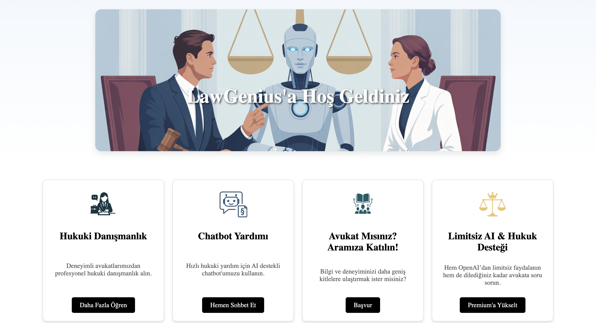

### Kayıt Olma Ekranı
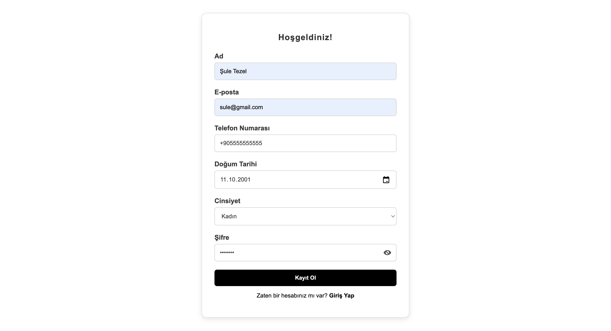

### Giriş Ekranı
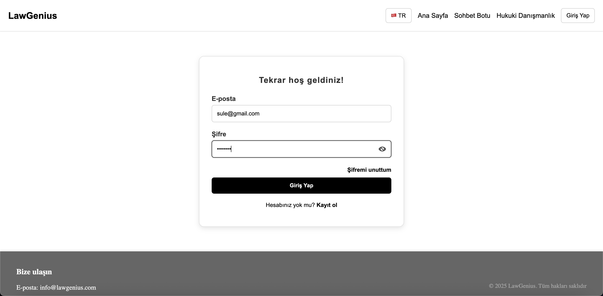

### Şifre Sıfırlama – Adım 1: E-posta Girme
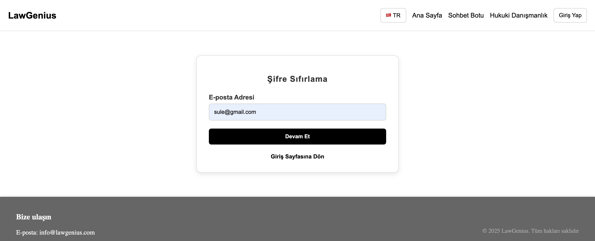

### Şifre Sıfırlama – Adım 2: Yeni Şifre Belirleme
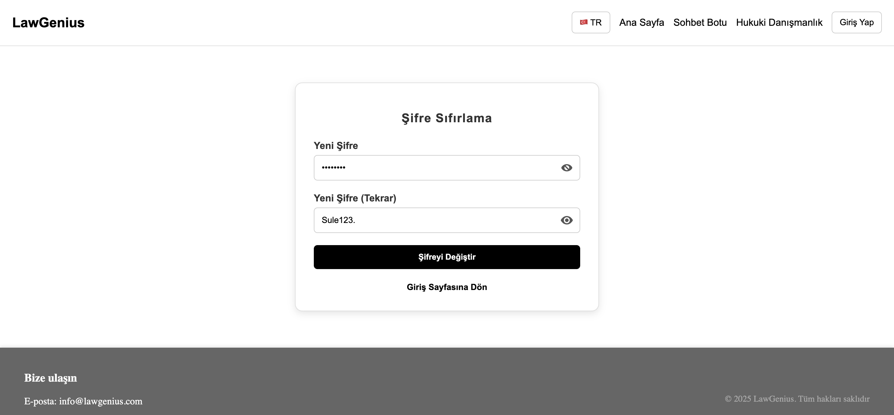

### Profil Bilgileri Güncelleme
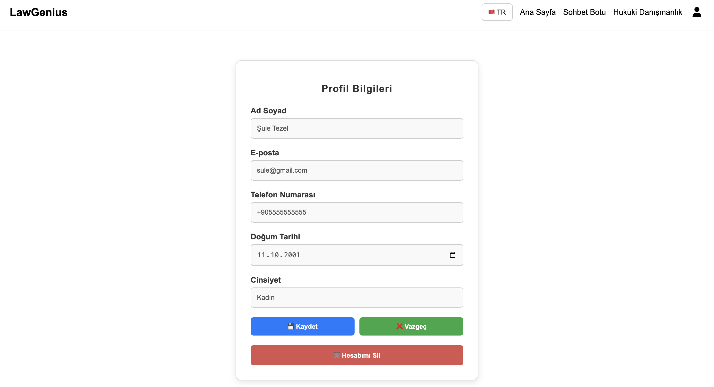

### Onaylı Avukat Listesi (Hukuki Danışmanlık Sayfası)
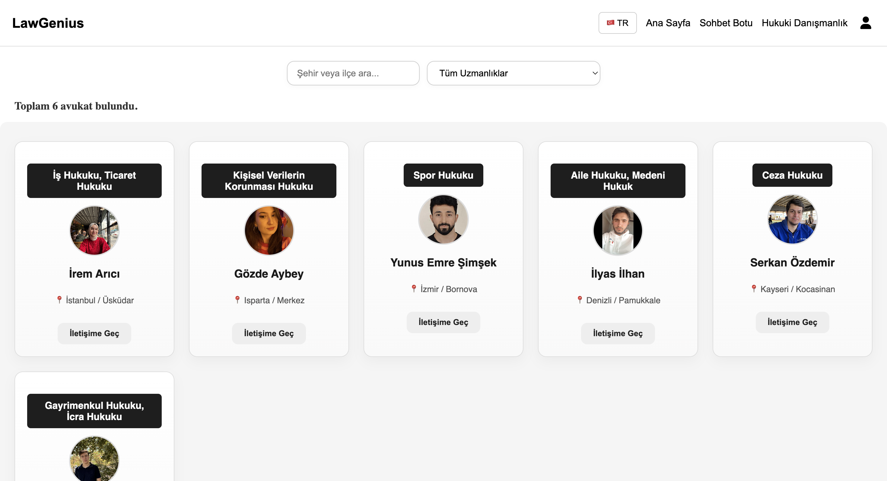

### Avukat Filtreleme Özelliği
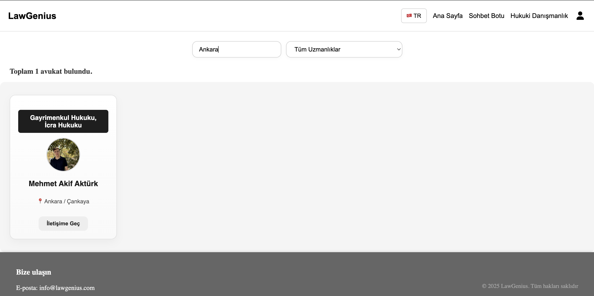

### Avukat ile Mesajlaşma – Kullanıcı İlk Mesaj
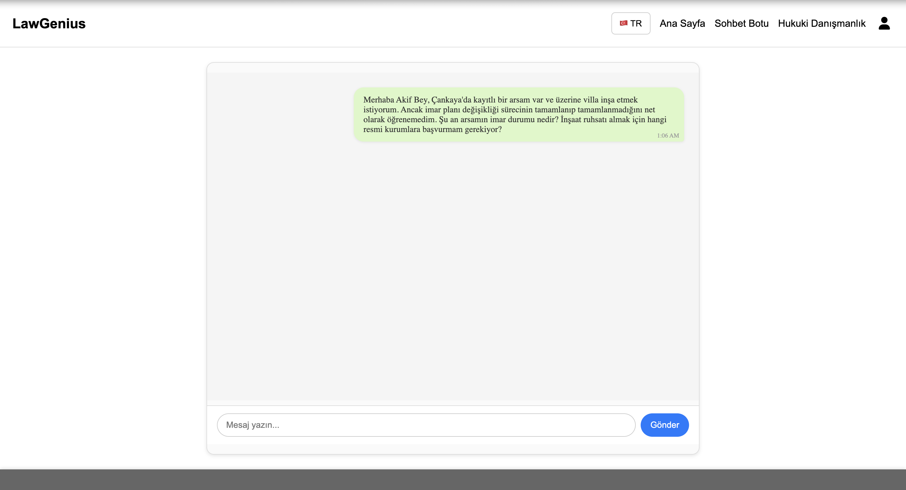

### Avukat Yanıtları – Görüşme Akışı
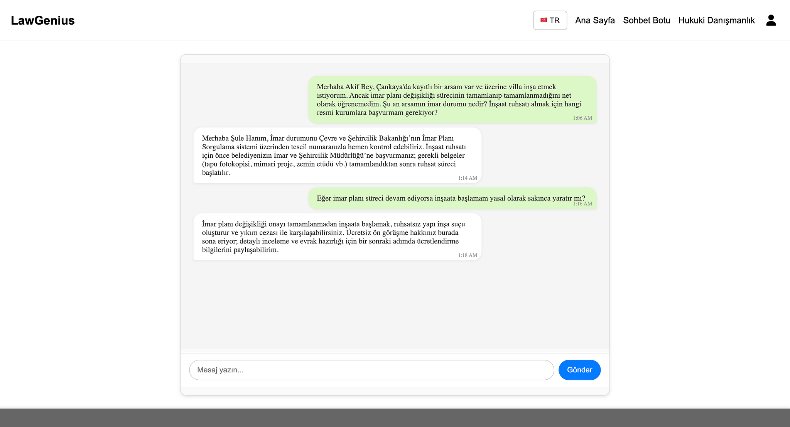

### Chatbot ile Yapay Zeka Destekli Danışmanlık
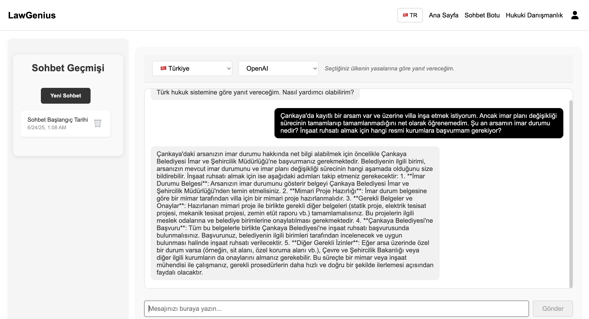

### Kullanıcının Sohbet Geçmişi
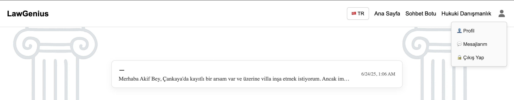

### Sohbet Geçmişi – Chatbot
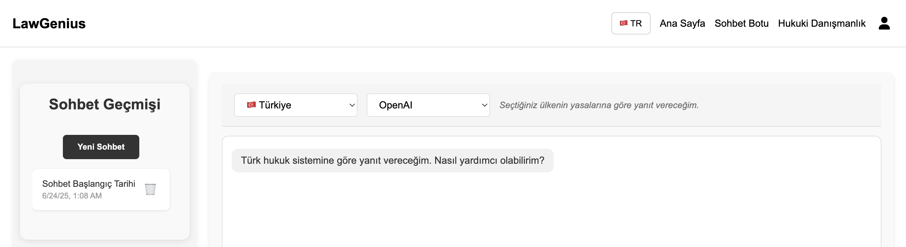

### Premium Üyelik Sayfası
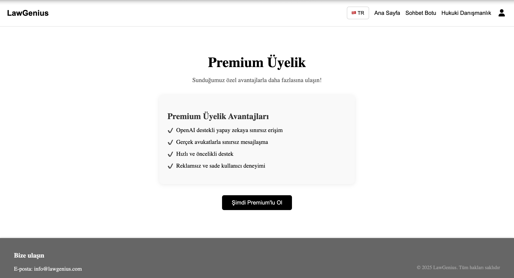

### Çıkış Menüsü


---

## ⚖️ Avukat Paneli Ekran Görüntüleri

### Avukat Başvuru Formu
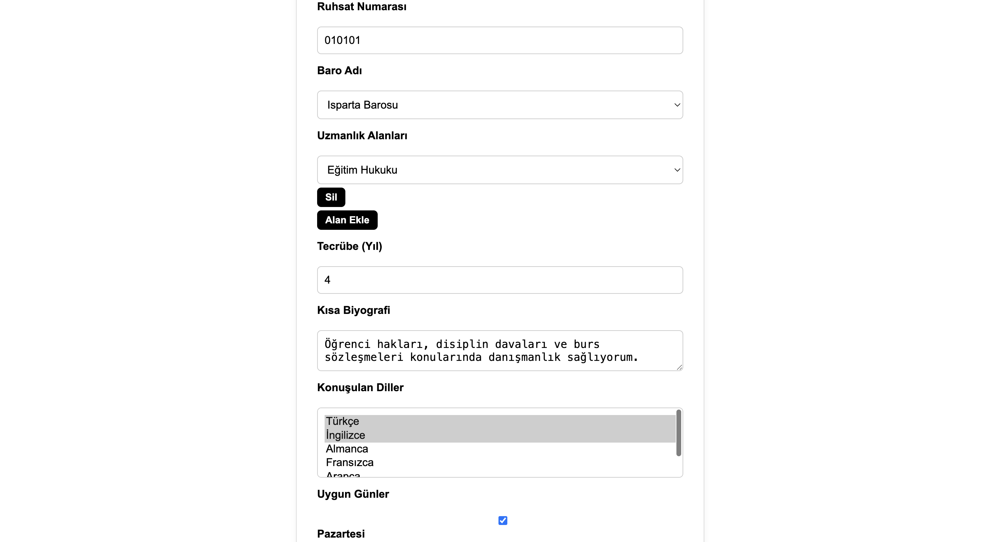

### Avukat Mesaj Listesi


---

## 🛠️ Admin Paneli Ekran Görüntüleri

### Onay Bekleyen Avukatlar
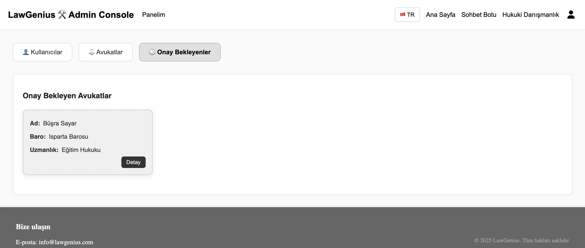

### Avukat Başvuru Detayı
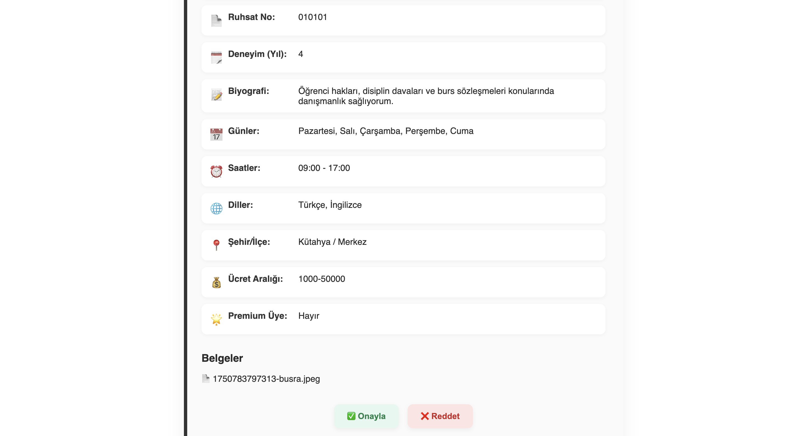

### Onaylı Avukatlar Listesi
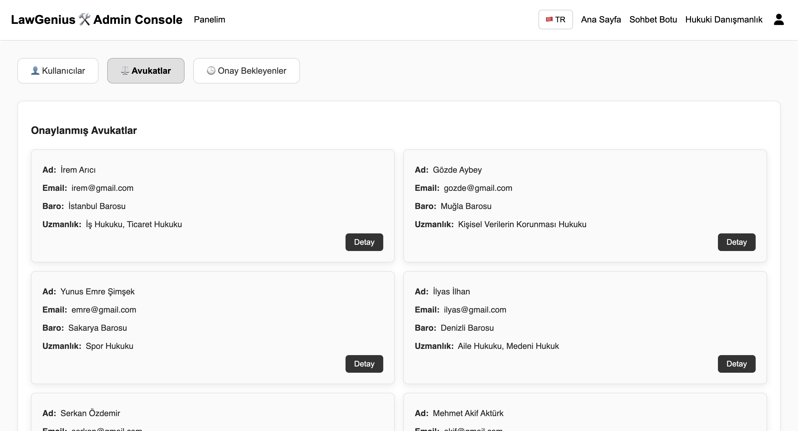

### Avukat Detay Sayfası
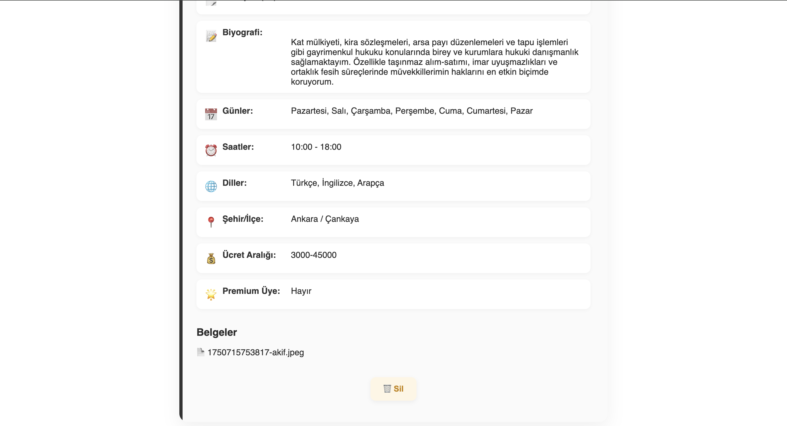

### Kullanıcılar Listesi
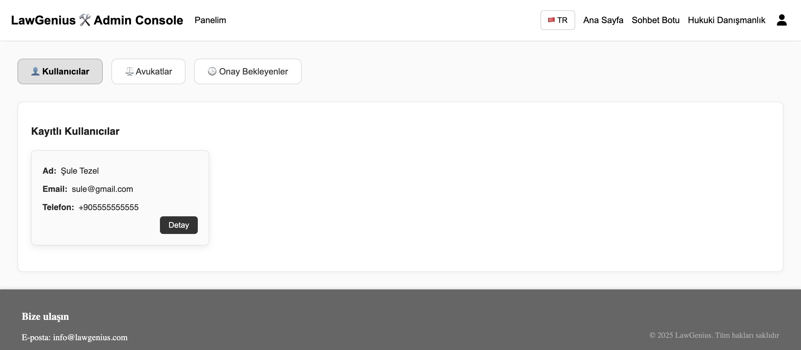

### Kullanıcı Detay Sayfası
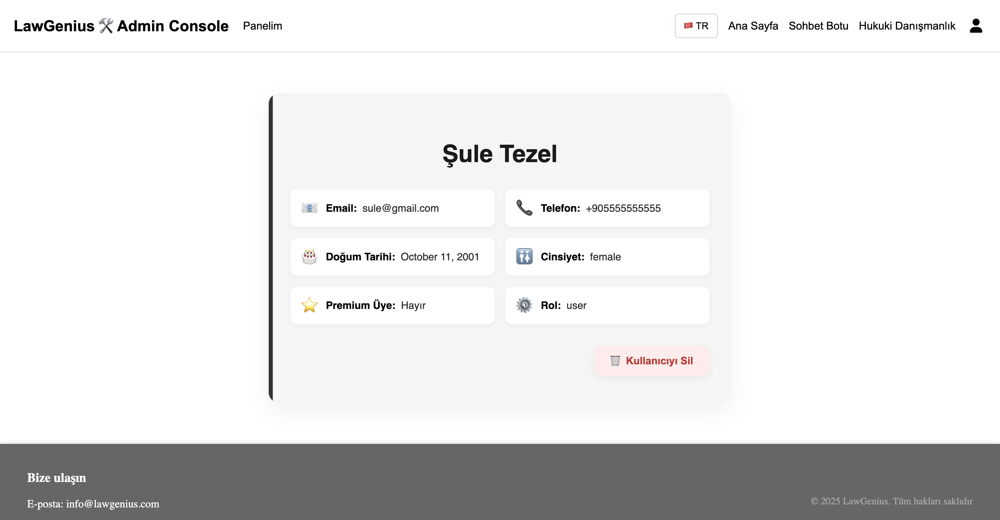

---

## 📌 Notlar

- `.env` gibi gizli dosyalar `.gitignore` ile korunmaktadır
- AI özelliklerini kullanmak için OpenAI API anahtarınızı `.env` dosyasına girmeniz gereklidir
- Türkçe hukuk modeli ile çalışmak için LoRA ağırlıkları ayrıca yüklenmelidir
